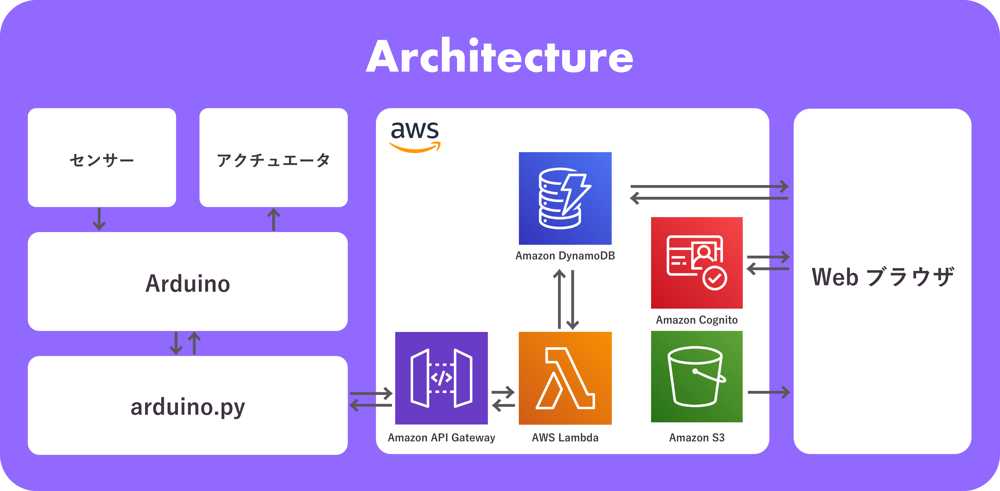

# What is ballooooney?

Ballooooney is a web based game using Arduino and Sensors

Values of sensors are sent to Amazon DynamoDB with Amazon API Gateway and AWS Lambda

3D Models were made with Blender, then imported with Three.js
